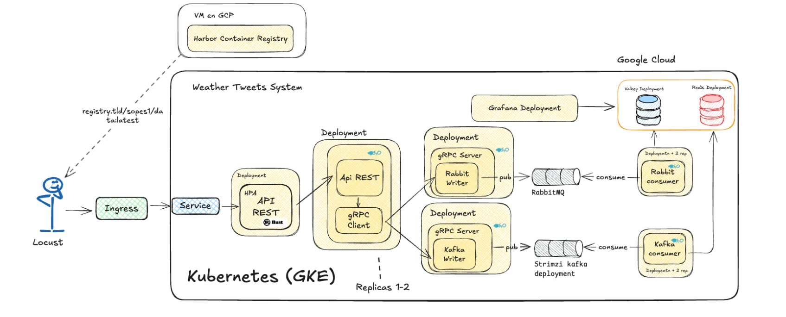

<div style="text-align: center;">

# Universidad San Carlos de Guatemala

## Facultad de ingenieria

### Proyecto 2: Tweets del Clima

SISTEMAS OPERATIVOS 1

Gonzalo Fenando Pérez Cazún
202211515

</div>

---

# Preguntas

- ¿Cómo funciona Kafka?

Se basa en un concepto en el cual hay producers que se encargan de la publicacion de mensajes en los topics, y por el otro lado los consumers se encagan de leer esta informacion. se mensiono en el anterior afirmacion topic y que es esto, esto no es mas que una categoria o canal donde se publican los mensajes. la secuencia seria algo asi:

1. Un productor envía un mensaje a un topic.
2. El topic está dividido en particiones, y Kafka escribe el mensaje en una partición específica.
3. Kafka almacena estos mensajes de forma persistente en disco.
4. Un consumidor lee los mensajes de una o más particiones.
5. Cada mensaje tiene un offset (índice único dentro de una partición) que permite a los consumidores hacer seguimiento.

- ¿Cómo difiere Valkey de Redis?

Cabe mensionar que valkey es opensource ya que desde no hace mucho redis cambio su licencia a una mas restrictiva. y por el momento valkey comparte una compativilidad del 100% con redis 7.2%, bueno en contexto tecnico no hay mayor diferecia que valkey se puede ver como un redis identico pero openSource.

- ¿Es mejor gRPC que HTTP?

El comentario puede estar influenciado por preferencias personales ya que para mi el uso del protocolo http se me hace mas un poco mas entendible a simple vista de que metodo se esta implementando y a donde se llama, aunque cabe mensionar que gRPC nos ofrece alta velocidad especial en este caso ya que se debian manejar una alca concurecia de peticioens.

- ¿Hubo una mejora al utilizar dos replicas en los deployments de API REST y gRPC? Justifique su respuesta.

Claranmente que hubo una mejora y mas cuando se estreso el sistema ya que si una replica fallaba la otra podia segir trabajando esto se resume a que habian menos peticiones que fallaban.

- Para los consumidores, ¿Qué utilizó y por qué?

Utilice Kafka porque esta diseñado para alto rendimiento, procesa en paralelo, ademas garantiza orden dentro de particiones y manejo offsets para tolerancia a fallos y repocesamiento.

Tambien se tulizo Rabbitmq, tiene algo muy interesante que son las colas, enrutamiento y confirmaciones.

# Pasos para crear GCP + GKE y desplegar con kubectl

1. Desde la interfas grafica se puede crear un cluster el cual nos servira para o tambien se puede hacecr mediante la linea de comando con valore spredtermianos.

```bash
gcloud container clusters create my-cluster \
  --num-nodes=2 \
  --enable-ip-alias
```

2. Conectar kubectl al clúster

```bash
gcloud container clusters get-credentials my-cluster
```

3.  Verificar que todo está OK

```bash
kubectl get nodes

```

# Comandos basicos

Verificar instalación

```bash
kubectl version --client

```

Obtener información del clúster

```bash
kubectl cluster-info          # Info del clúster actual
kubectl get nodes             # Lista de nodos activos
kubectl get namespaces        # Espacios de nombres existentes
kubectl get pods              # Lista de pods en el namespace actual
```

Aplicar (crear/actualizar) recursos

```bash
kubectl apply -f <archivo.yaml>
```

Eliminar recursos

```bash
kubectl delete -f <archivo.yaml>
```

# Estructuras básicas (plantillas)

1. Deployment (despliegue de una app)

```yaml
apiVersion: apps/v1 # Versión de la API de Kubernetes para Deployments
kind: Deployment # Tipo de recurso

metadata:
  name: my-app # Nombre del Deployment

spec:
  replicas: 2 # Número de réplicas (pods) deseadas
  selector: # Cómo Kubernetes selecciona qué pods controlar
    matchLabels:
      app: my-app
  template: # Definición de los pods
    metadata:
      labels:
        app: my-app # Etiqueta para emparejar con el selector del Service y PDB
    spec:
      containers:
        - name: my-app # Nombre del contenedor
          image: my-image:latest # Imagen Docker a usar
          ports:
            - containerPort: 5000 # Puerto expuesto por el contenedor
```

2. Service (exponer un deployment)

```yaml
apiVersion: v1
kind: Service # Tipo de recurso: Service (acceso a los pods)

metadata:
  name: my-service # Nombre del servicio

spec:
  type: LoadBalancer # Tipo de exposición (ClusterIP, NodePort o LoadBalancer)
  selector:
    app: my-app # Selecciona los pods con esta etiqueta
  ports:
    - port: 80 # Puerto externo del servicio
      targetPort: 5000 # Puerto interno del contenedor al que se redirige
```

3. Ingress (gestionar entrada HTTP)

````yaml
apiVersion: networking.k8s.io/v1
kind: Ingress # Tipo de recurso: Ingress (gestión de rutas HTTP)

metadata:
  name: my-ingress
  annotations:
    nginx.ingress.kubernetes.io/rewrite-target: / # Reescribe la URL si es necesario

spec:
  rules:
    - host: my-app.example.com # Dominio que apuntará a este servicio
      http:
        paths:
          - path: / # Ruta que será redirigida
            pathType: Prefix
            backend:
              service:
                name: my-service # Nombre del servicio de backend
                port:
                  number: 80 # Puerto del serviciobash

```yaml
apiVersion: policy/v1
kind: PodDisruptionBudget # Recurso para controlar interrupciones voluntarias

metadata:
  name: my-app-pdb

spec:
  minAvailable: 1 # Número mínimo de pods disponibles durante actualizaciones
  selector:
    matchLabels:
      app: my-app # Aplica solo a pods con esta etiqueta
````

# Secuencia del tabajo

## [ENUNCIADO](Proyecto2.pdf)


